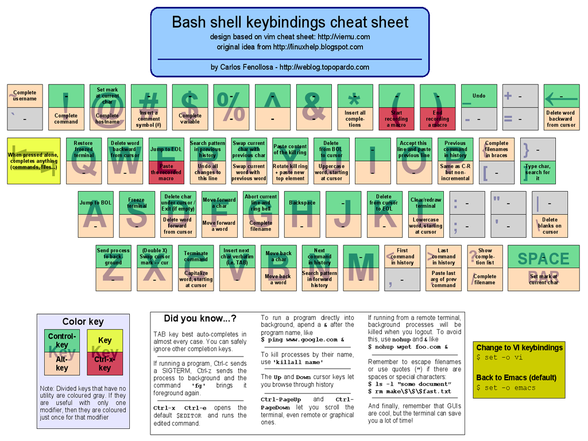

#### bash keyboard shortcuts

```
Ctrl+A   jump to the start of the line
Ctrl+E   jump to the end of the line
Ctrl+L   clear the screen
Ctrl+K   cut current line right of of cursor
Ctrl+U   cut current line left of cursor
Ctrl+Y   paste the buffer
Ctrl+W   Erase previous word
Ctrl+XE  edit and run a new command in text editor
Ctrl+XX  move between EOL and current cursor position
Ctrl+C   terminate the running command/send SIGTERM
Ctrl+Z   suspend the running command  see job control
Alt+?    Show current completion list
Alt+C    capitalize the word
Alt+L    make the word lowercase
Alt+U    make word uppercase
Alt+*    insert all possible completions
ESC.     insert last argument of previous command
```

#### bash history

```
Ctrl+R   search the history by typing
  Ctrl+R   search the previous occurence
  Enter    run the current search result
  ESC      edit the current search result
  Ctrl+C   abort search

!!       re-run previous command
!-2      re-run second previous command
!-3      re-run third previous command...
!example re-run last previous command starting with example
!?hop    re-run last previous command containing hop
!xyz:p   only display last command starting with xyz
fc       edit and run previous command in text editor
!122     run command number 122 from history
!:2      Second argument of last command
!:2-5    Second to fifth argument of last command
!$       Last argument of last command
!*       All arguments of the last command
!^       First argument of last command
^foo^bar Last command with first instance of 'foo' replaced with 'bar'
!:gs/foo/bar  Last command with all instances of 'foo' replaced with 'bar
```

```
ls x:y:z
where
x is a position in bash history (ex. !!, !-3)
y is the position of argument (^, $, 3, 4...)
z is a function like:
h (remove last path item)
t (remove leading path)
r (remove extension)
s (sed-like substitution ex. s/ls -l/cat)
p (only print the command, do not run it)
```

#### bash job control

```
Ctrl+C     stop/exit/terminate the currently running task
Ctrl+Z     pause (suspend) the currently running task
fg         resume a paused job (in foreground)
bg         send a paused job to background and resume
jobs       list current jobs
fg 3       bring job number 3 to foreground
disown     remove all jobs from the current shell
command &  run a command in background

```

#### bash builtin variables

```
$0   name of the script
$n   positional parameters to script/function
$$   PID of the script
$!   PID of the last command executed (and run in the background)
$?   exit status of the last command  (${PIPESTATUS} for pipelined commands)
$#   number of parameters to script/function
$@   all parameters to script/function (sees arguments as separate word)
$*   all parameters to script/function (sees arguments as single word)
```


#### bash variable substitution

```
${VARNAME:-foo} fallback to 'foo' if variable is undefined
${VARNAME:-}    fallback to empty string if variable is undefined
${VARNAME:=foo} ASSIGN to foo if variable is undefined
```

```
${var#*SEP}   remove shortest left segment of variable
${var##*SEP}  remove longest left segment of variable
${var%SEP*}   remove shortest right segment of variable
${var%%SEP*} remove shortest right segment of variable
```

```
${#VARNAME} # variable length
```

```
${f/path?/x}   # "x/path2/file.ext"
${f//path?/x}  # "x/x/file.ext"
```


##### bash variable slicing

```
${<var>:<start>} or ${<var>:<start>:<length>}`
${f:6}            # "path2/file.ext"
${f:6:5}          # "path2"
${f: -8}          # "file.ext"(Note: space before "-")
```

```
readonly DIR_SEP="/"
array=(${f//${DIR_SEP}/ })
second_dir="${array[1]}"     # = path2
```

#### bash error handling

```
set -o errexit    exit script on error (set -o errexit)
set -o nounset    exit when accessing an undefined variable
commmand||true    disable 'exit on error' for a single command

```

#### bash arrays

Without quotes there is no difference between `$@` and `$*`. With double quotes, `"$@"` expands to each parameter as its own argument: `"$1" "$2"` ..., while `"$*"` expands to the single argument `"$1c$2c..."`, where `c` is the first character of IFS. You almost always want `"$@"` (QUOTED!).


```
# define array
ARGS=(-f -x -n foo)
# add items to array based on conditions
if [ -r "$filename" ]; then ARGS+=(-r "$filename"); fi;
# pass the array as command arguments
program "${ARGS[@]}"
```

```
Declare an array                   ARR=(value1 value2 value3)
print an array                     printf "%s\n" "${ARR[@]}"
print all items in an array        ${ARR[*]}
print all indexes in an array      # ${!ARR[*]}
print Number of items in an array  ${#ARR[*]}
print Length of array item zero    ${#ARR[0]}

#Iterate Through Array Values 
for i in "${ARR[@]}"; do echo $i; done


# define value of specific item number in array
while true; do var[0]=K; var[1]=I; var[2]=L; var[3]=L; var[4]="_"; var[5]=A; var[6]=L; var[7]=L; var[8]="_"; var[9]=H; var[10]=U; var[11]=M; var[12]=A; var[13]=N; var[14]=S; var[15]="_"; for i in $(seq 0 15); do echo -n ${var[$i]}; done; done
```


#### Use Double brackets

Favor `[[]]` (double brackets) over `[]` . `[[]]` avoids problems like unexpected pathname expansion, offers some syntactical improvements, and adds new functionality:


	Operator        Meaning
    ||             logical OR
    &&             logical AND
    <              \string comparison (no escaping necessary within double brackets)
    -lt            numerical comparison
    =              string equality
    ==             string matching with globbing (double brackets only, see below)
    =~             string matching with regular expressions (double brackets only , see below)
    -n             string is non-empty
    -z             string is empty
    -eq            numerical equality
    -ne            numerical inequality

    Examples
    t="abc123"
    [[ "$t" == abc* ]]         # true (globbing)
    [[ "$t" == "abc*" ]]       # false (literal matching)
    [[ "$t" =~ [abc]+[123]+ ]] # true (regular expression)
    [[ "$t" =~ "abc*" ]]       # false (literal matching)


#### bash process substitution


```
$ diff -u <(ps) <(ps -e)
$ diff -u .bashrc <(ssh remote cat .bashrc)
$ rsync -arv --log-file=>(grep -vF .tmp >log.txt) src/ host::dst/
$ ps -ef | tee >(awk '$1=="tom"' >toms-procs.txt) \
               >(awk '$1=="root"' >roots-procs.txt) \
               >(awk '$1!="httpd"' >not-apache-procs.txt) \
               >(awk 'NR>1{print $1}' >pids-only.txt)
```


#### bash misc

- convert text to uppercase `upper() { echo ${@^^}; }`


---------------------------------------------------------


